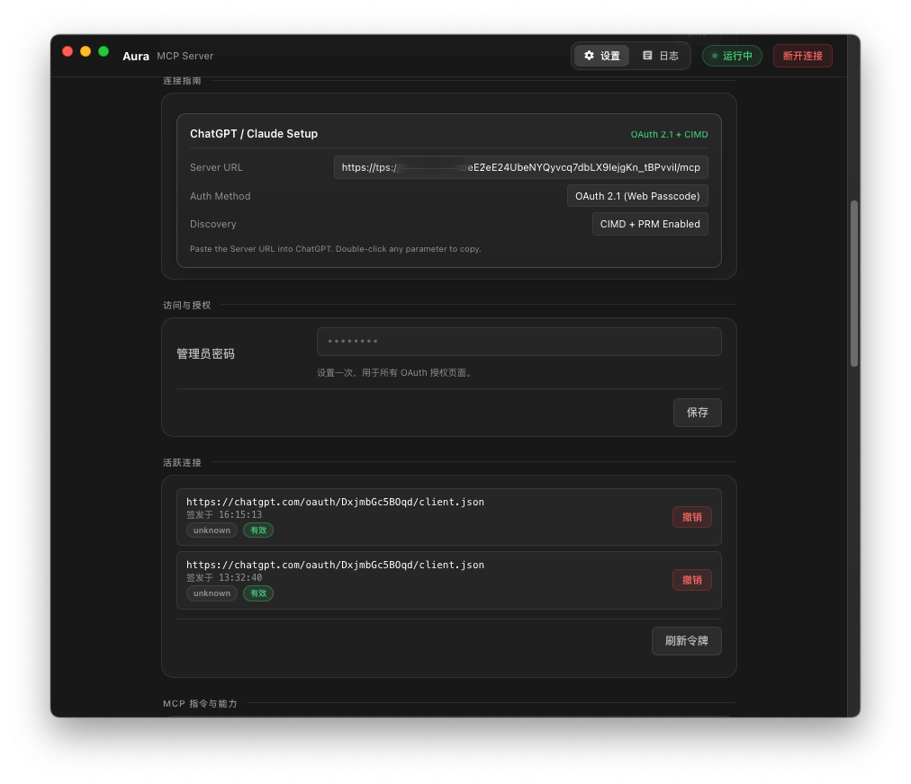

<div align="center">
  
  <h1>Aura</h1>
  <p>
    <strong>Securely connect AI to your local machine through MCP.</strong><br />
    通过 MCP，让 AI 安全连接你的本地电脑。
  </p>
</div>

## 中文

**Aura 是一款让 AI 安全连接本地电脑的桌面 MCP Bridge。**  
它在你的电脑上运行本地 MCP Server，将文件读写、终端命令、Skills 以及可选的 Pi Tools，通过受控的 MCP 接口提供给 ChatGPT、Claude 和其他支持 MCP 的 AI 客户端。

Aura 将本地能力、安全策略、Token 授权、文件系统沙箱、Shell 权限控制、运行日志和远程连接整合在一个桌面应用中，并支持 Cloudflare Tunnel、OpenAI Secure MCP Tunnel 以及自定义反向代理，让你无需自己拼装复杂的 MCP、授权和 Tunnel 基础设施，就能把自己的电脑变成一个可由 AI 安全调用的本地能力节点。

## English

**Aura is a desktop MCP bridge that securely connects AI assistants to your local computer.**  
It runs a local MCP server and gives ChatGPT, Claude, and other MCP-compatible clients controlled access to capabilities such as file operations, shell commands, Skills, and optional Pi Tools.

Aura brings local capabilities, security policies, token authorization, filesystem sandboxing, shell access control, runtime logs, and remote connectivity into a single desktop application. With support for Cloudflare Tunnel, OpenAI Secure MCP Tunnel, and custom reverse proxies, Aura removes the need to manually assemble MCP servers, authorization, and tunneling infrastructure—turning your computer into a secure local capability node for AI.

## Screenshots / 截图

- 
- 
- 
- 
- 
- 
- 

## Features / 核心能力

- MCP HTTP server with secure token-based auth for AI client access.
- Multiple connectivity paths so you can expose MCP over:
  - Cloudflare Named Tunnel (uses local `~/.cloudflared/config.yml`)
  - Cloudflare Quick Tunnel (quick random URL)
  - OpenAI Secure MCP Tunnel (official tunnel transport, auth handled by transport)
  - Custom/BYO tunnel (Caddy / FRP / ngrok / any reverse proxy endpoint)
- OAuth-like admin approval flow in the browser using CIMD/metadata endpoints.
- Optional Pi integration:
  - Load Pi skills from Pi resource loader when available.
  - Load selected Pi tools directly and execute them through Aura.
- Runtime visibility:
  - Real-time MCP/tool logs
  - Tunnel process logs
  - Service lifecycle logs
  - Active token list with one-click revocation
- Security controls in UI:
  - Filesystem root sandbox (`~/` by default)
  - Shell policy: unrestricted, allowlist-only, or denylist
  - Allowlist and denylist editor
  - Admin password stored via Electron safeStorage (OS keychain/credential store)
- Bilingual UI (English / 简体中文), dark/light themes.

## Repository layout

- `src/main.js` — Electron main process, service lifecycle, tray and runtime state.
- `src/auth.js` — OAuth/CIMD metadata, token generation and validation.
- `src/mcp.js` — MCP server registration and tool routing.
- `src/pi-bridge.js` — Pi bridge wrapper and Pi tool execution.
- `src/config.js` — settings store and defaults.
- `src/renderer.js` — settings UI and live logs.
- `src/preload.js` — secure IPC surface for renderer.
- `src/tunnel*` & `src/cloudflare-config.cjs` — tunnel mode handling and Cloudflare helpers.
- `src/skills.js` — local Skill discovery and access helpers.

## Core settings

- **Tunnel mode**
  - `cloudflare-named`
  - `cloudflare-quick`
  - `openai`
  - `custom`
- **MCP listen address/port**
  - Default `127.0.0.1:3000`
- **MCP path**
  - Auto-generated random path by default to reduce guessing risk.
- **Token expiry**
  - User-selectable duration from UI during approval flow.
- **Capabilities**
  - Default tools: file read/write, execute shell, skill listing/reading.
- **Pi options**
  - Optional Pi capability toggle and selected Pi tools list.

## Quick start

```bash
cd Aura
npm install
npm run start
```

### Recommended first run

1. Start Aura.
2. Open the app settings and confirm tunnel mode.
3. Set admin password (optional but recommended).
4. Enable/disable shell policy + Pi features according to your risk preference.
5. Click **Connect**.
6. Copy the public MCP URL shown in the UI into your MCP client.
7. Complete authorization in the browser when prompted.

## Build and packaging

- `npm run start` — start app in dev-like local mode.
- `npm run pack` — package without signing.
- `npm run dist` — build distributables for all configured OS targets.
- `npm run dist:mac` / `npm run dist:win` / `npm run dist:linux` — platform-targeted builds.

Current `build` config includes:
- macOS: `dmg`, `zip`
- Windows: `nsis`, `zip`
- Linux: `AppImage`, `deb`

## Scripts and metadata

- Node: Electron app entry in `src/main.js`
- App id: `fun.xrsec.aura`
- Repository: `git@github.com:XRSec/Aura.git`
- License: MIT

## Notes

- Config and token files are stored under the Electron userData directory.
- Logs are kept locally with retention and trimming for stability.
- The app avoids shipping bundled tunnel binaries and prefers discovered local binaries where possible.

## Compatibility

Aura is intentionally flexible and runs on different local setups, but successful connectivity depends on:
- valid tunnel binaries/credentials for the selected mode
- network/firewall policy on the host
- MCP client support for your selected transport
