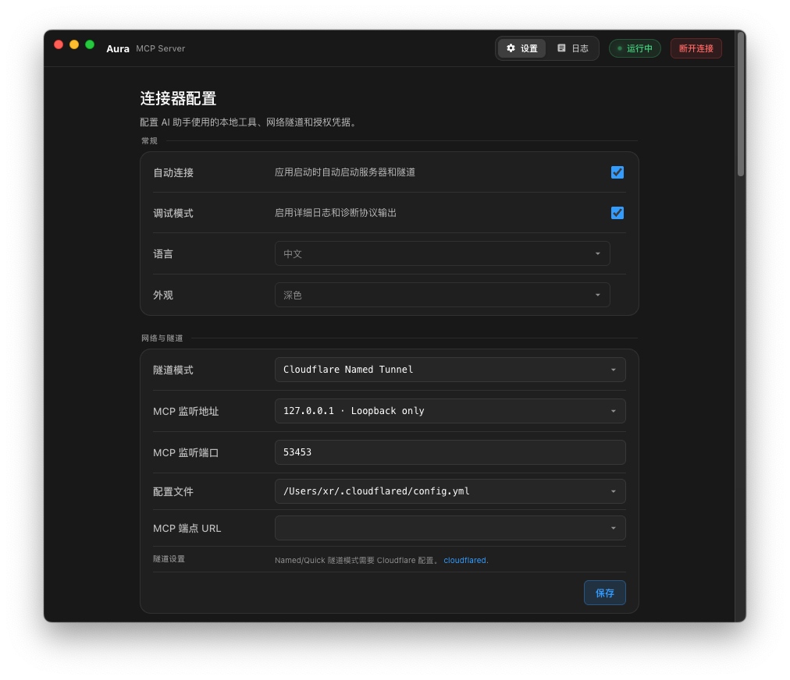
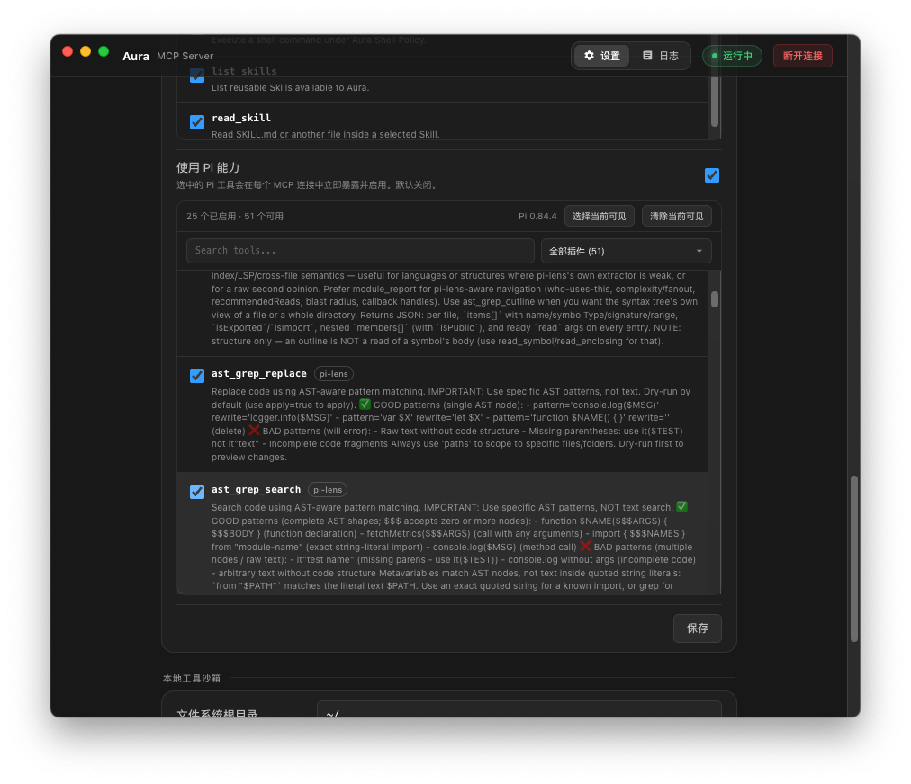
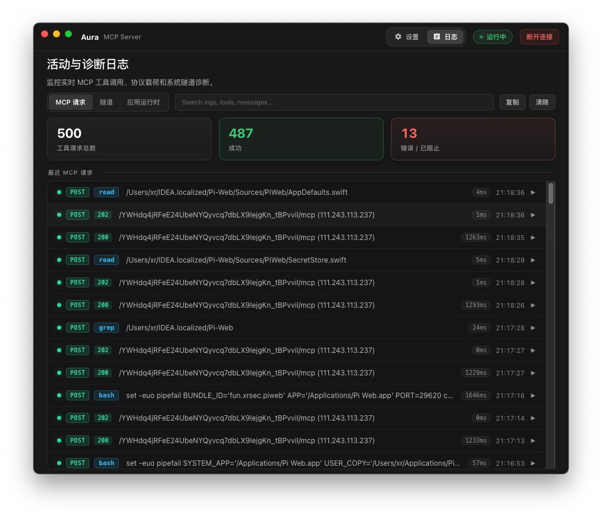
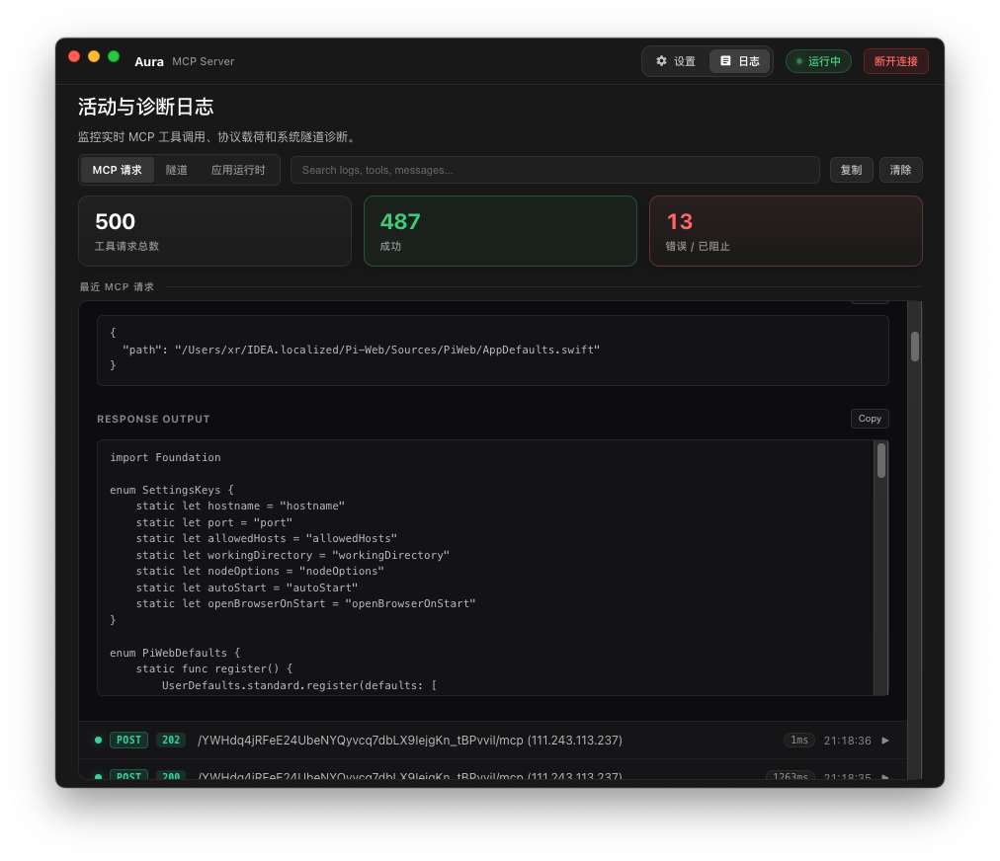
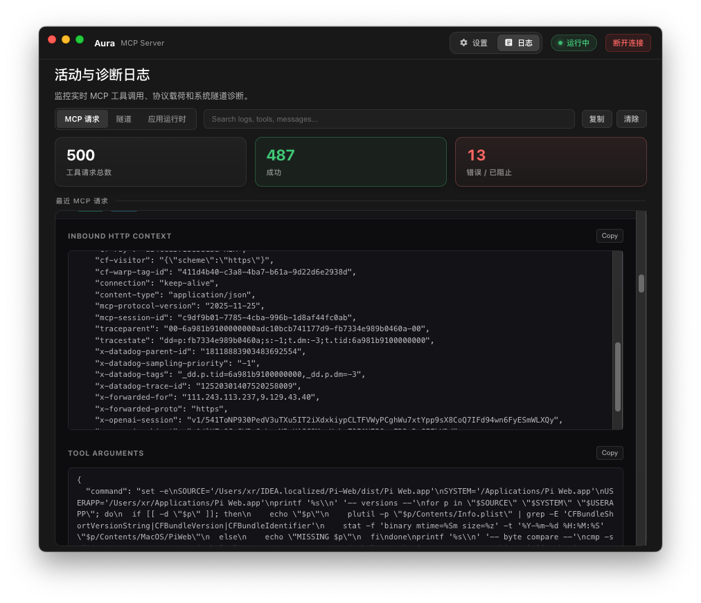

<div align="center">
  
  <h1>Aura</h1>
  <p><strong>把 AI 安全地连接到你的本地电脑。</strong></p>
  <p>轻量、可控、面向本地能力的桌面 MCP Bridge（基于 Tauri 2 与 Rust 原生 MCP Runtime）。</p>

  <p>
    <a href="README.md">简体中文</a> ·
    <a href="README_EN.md">English</a>
  </p>

  <p>
    
    
    
    
  </p>
</div>

---

## Aura 是什么？

**Aura 是一个运行在你电脑上的桌面 MCP Bridge。**

它把本地文件、终端命令、Skills，以及可选的 Pi Tools，通过受控的 MCP 接口提供给 ChatGPT 和其他支持 MCP 的 AI 客户端。

你不需要分别搭建 MCP Server、授权页面、Token 管理、Tunnel、日志和本地权限控制。Aura 把这些能力整合进一个极小体积（~4
MB）的桌面应用，让你的电脑成为一个可以被 AI 调用、同时又能明确限制权限边界的本地能力节点。

```text
ChatGPT / MCP Client
        │
        │ HTTPS / MCP
        ▼
Cloudflare / OpenAI Secure Tunnel / Custom Proxy
        │
        ▼
   Aura (Tauri + Rust MCP)
  ┌─────┼──────────────────────────┐
  │     │                          │
Files  Shell   Skills          Pi Tools
  │     │                          │
  └─────┴──── Policy & Auth ───────┘
              │
              ▼
        Your Local Machine
```

## 为什么使用 Aura？

传统的本地 MCP 接入通常需要自己处理 Server、认证、反向代理、权限边界、日志和不同客户端之间的连接细节。

Aura 将这些环节收敛成一个现代化桌面应用：

- **极简极轻（Tauri 2 + Rust）**：安装包仅约 4 MB，不捆绑笨重的 Node Runtime / Chromium，利用系统 WebView 与原生 Rust 实现。
- **一个 App 管理本地 MCP**：连接、授权、能力、日志、Tunnel 集中配置。
- **本地能力可控暴露**：只向 AI 提供你明确允许的文件、Shell、Skill 和 Pi Tool。
- **多种公网连接方式**：支持 Cloudflare Named Tunnel、Cloudflare Quick Tunnel、OpenAI Secure MCP Tunnel 和自定义反向代理。
- **无缝复用 Pi 生态**：如果启用 Pi，Aura 动态复用本机现有的 Node (>=22.19) 和 Pi Coding Agent 执行所选 Pi Tools，不通过
  `session.prompt()` 间接调用模型。
- **适合 ChatGPT Custom App / MCP Client**：将生成的 MCP 地址添加到客户端即可使用。
- **跨平台桌面应用**：构建目标覆盖 macOS、Windows 和 Linux。

## 核心能力

### 原生 Rust MCP Server

Aura 在本机启动高性能 Rust MCP Server，并可提供以下基础能力：

| Tool            | 作用                                           |
|-----------------|------------------------------------------------|
| `read_file`     | 读取 Filesystem Root 范围内的 UTF-8 文件       |
| `write_file`    | 创建或覆盖 Filesystem Root 范围内的 UTF-8 文件 |
| `execute_shell` | 按 Aura Shell Policy 执行本地命令              |
| `list_skills`   | 列出 Aura 可访问的 Skills                      |
| `read_skill`    | 读取 Skill 的 `SKILL.md` 及相对引用文件        |

你可以在设置中决定是否启用默认能力，以及具体开放哪些工具。

### Pi Tools / Skills

如果本机安装了 Pi，Aura 可以复用 Pi 的能力注册表：

- 读取 Pi ResourceLoader 发现的 Skills。
- 选择需要暴露给 MCP 的 Pi Tools。
- MCP 会话连接后，已选择的 Pi Tools 可直接暴露其 Schema 并执行。
- `request_capabilities` 主要用于按需加载 Pi Skills。
- Aura 直接调用 Pi Tool 的 `execute()`，不会通过 Pi Agent 的 `session.prompt()` 执行。
- 可能调用 Pi 默认模型的能力默认阻止，可在设置中单独控制。

这使 Aura 不只是一个 Filesystem / Shell MCP Server，也可以成为 **Pi 本地工具生态与 ChatGPT 之间的能力桥**。

## Tunnel / 连接方式

Aura 当前支持四种连接模式：

| 模式                         | 适用场景                              | 本地依赖                        |
|------------------------------|---------------------------------------|---------------------------------|
| **Cloudflare Named Tunnel**  | 已有域名、长期稳定使用                | `cloudflared` + Cloudflare 配置 |
| **Cloudflare Quick Tunnel**  | 临时测试、快速连接                    | `cloudflared`                   |
| **OpenAI Secure MCP Tunnel** | 使用 OpenAI 官方 Secure MCP Tunnel    | `tunnel-client`                 |
| **Custom / BYO Tunnel**      | 已有 Caddy、FRP、ngrok 或其他反向代理 | 由你自行提供公网入口            |

Aura 不强制绑定某一家 Tunnel 服务。你可以在不同网络环境中选择合适的暴露方式。

## 安全边界

Aura 的目标不是“让 AI 无限制控制电脑”，而是让本地能力以明确的边界暴露。

主要控制项包括：

- **Filesystem Root**：文件操作只能在配置的根目录中进行，默认值为 `~/`。
- **Shell Policy**：支持 `unrestricted`、`allowlist` 和 `denylist` 三种模式。
- **DNS Rebinding 防护**：Rust MCP 服务严格校验 Host header。
- **随机 MCP Path**：默认生成高熵随机 MCP 路径，降低路径被猜测的风险。
- **Token 授权**：通过浏览器授权流程创建访问 Token，并支持有效期设置。
- **Token 撤销**：可在 Aura 中查看活动 Token 并随时撤销。
- **系统 Keyring 凭据存储**：管理密码通过操作系统安全凭据管理器（macOS Keychain / Windows Credential Manager / Linux
  Secret Service）保存。
- **Pi Tool 选择**：只有在 Aura Settings 中选中的 Pi Tools 才会暴露。
- **本地日志**：MCP 调用、HTTP、Tunnel 和服务生命周期日志可在应用内查看。

> [!IMPORTANT]
> `execute_shell` 的实际风险取决于你的 Shell Policy。当前配置默认值为 `unrestricted`。如果 Aura 会暴露到公网，建议根据实际需求改为
`allowlist`，并限制 Filesystem Root。

## 截图

### 连接器配置



### 连接指南


### Pi 能力



### 活动与诊断日志



<details>
<summary>查看更多日志截图</summary>

#### MCP 细节



#### HTTP 细节



</details>

## 快速开始

### 从源码运行

```bash
git clone https://github.com/XRSec/Aura.git
cd Aura
npm install
npm run dev
```

### 首次连接建议

1. 启动 Aura。
2. 选择需要的 Tunnel 模式。
3. 设置 Filesystem Root。
4. 根据风险需求配置 Shell Policy。
5. 如果需要 Pi 能力，启用 Pi 并选择允许暴露的 Pi Tools。
6. 点击 **Connect**。
7. 将 Aura 显示的 MCP 地址添加到 ChatGPT 或其他 MCP 客户端。
8. 客户端发起连接时，在浏览器中完成授权。

如果使用 Cloudflare 模式，请确保本机可以找到 `cloudflared`；如果使用 OpenAI Secure MCP Tunnel，请安装或配置
`tunnel-client`。

## 构建

```bash
# 开发调试模式
npm run dev

# 默认 Release 构建
npm run build

# macOS 构建 (App / DMG)
npm run build:mac

# Windows 构建 (NSIS)
npm run build:win

# Linux 构建 (AppImage / DEB)
npm run build:linux
```

当前构建产物：

- **macOS**：DMG / App（约 3.8 MB DMG，4.7 MB App）
- **Windows**：NSIS Installer
- **Linux**：AppImage / DEB

## 项目结构

```text
Aura/
├── src/                        # 前端界面 (HTML / CSS / JS)
│   ├── index.html              # 主应用界面
│   ├── renderer.js             # 界面交互与事件绑定
│   ├── tauri-shim.js           # Tauri API 桥接层
│   └── assets/                 # 静态字体与图标
├── src-tauri/                  # Rust 后端 (Tauri 2)
│   ├── src/
│   │   ├── main.rs             # Tauri 启动入口
│   │   ├── lib.rs              # Tauri Command 与系统接口
│   │   ├── runtime.rs          # Rust MCP HTTP Server、OAuth 与 Tunnel 调度
│   │   ├── pi.rs               # Pi Coding Agent 原生桥接层
│   │   ├── skills.rs           # 本地 Skill 发现与读取
│   │   └── config.rs           # 配置存储与合并
│   ├── pi-worker.cjs           # Pi 能力发现 Worker
│   ├── Cargo.toml              # Rust 依赖配置
│   └── tauri.conf.json         # Tauri 窗口与打包配置
├── docs/
│   └── screenshots/            # 文档截图
└── package.json
```

## 默认配置摘要

| 配置            | 默认值             |
|-----------------|--------------------|
| MCP Listen      | `127.0.0.1:3000`   |
| Filesystem Root | `~/`               |
| Tunnel Mode     | `cloudflare-named` |
| Shell Policy    | `unrestricted`     |
| Pi              | Disabled           |
| UI Language     | English            |
| Appearance      | Dark               |

MCP Path 默认随机生成，并使用至少 40 个 URL-safe 字符组成的随机段。

## License

MIT

---

<div align="center">
  <strong>Aura — Local capabilities, under your control.</strong><br />
  本地能力，由你掌控。
</div>
